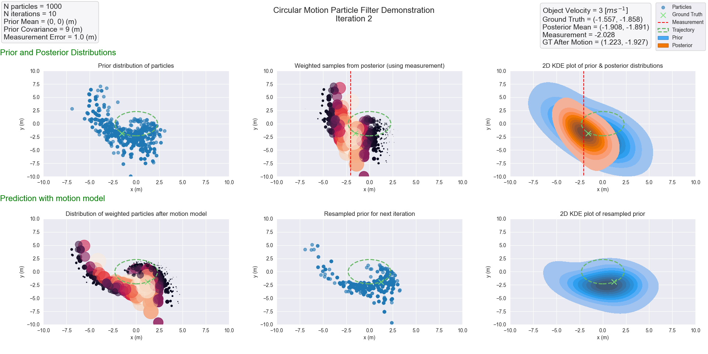
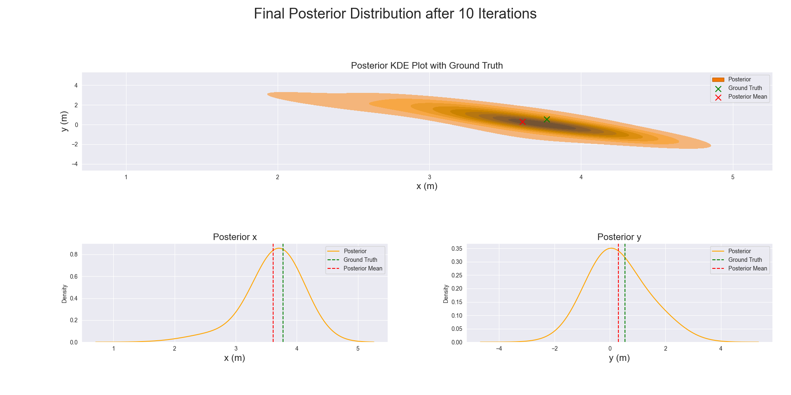

# Particle Filter Demonstration

This notebook gives a visual demonstration of a bootstrap particle filter for
a simple toy model in which an object undergoes 2D circular motion.
Each iteration is visually plotted to illustrate the convergence of
the algorithm.

## Dependencies

This notebook requires the following packages:
- `numpy`
- `matplotlib`
- `seaborn`

## Visual Demo

If the notebook runs correctly, the result should look like this.
This is a visual overview of one iteration of the algorithm. Note:
these figures were optimised for a 1080p screen. Other screen
resolutions may produce overlapping or poorly spaced figures.

And the final posterior distribution after all iterations:

